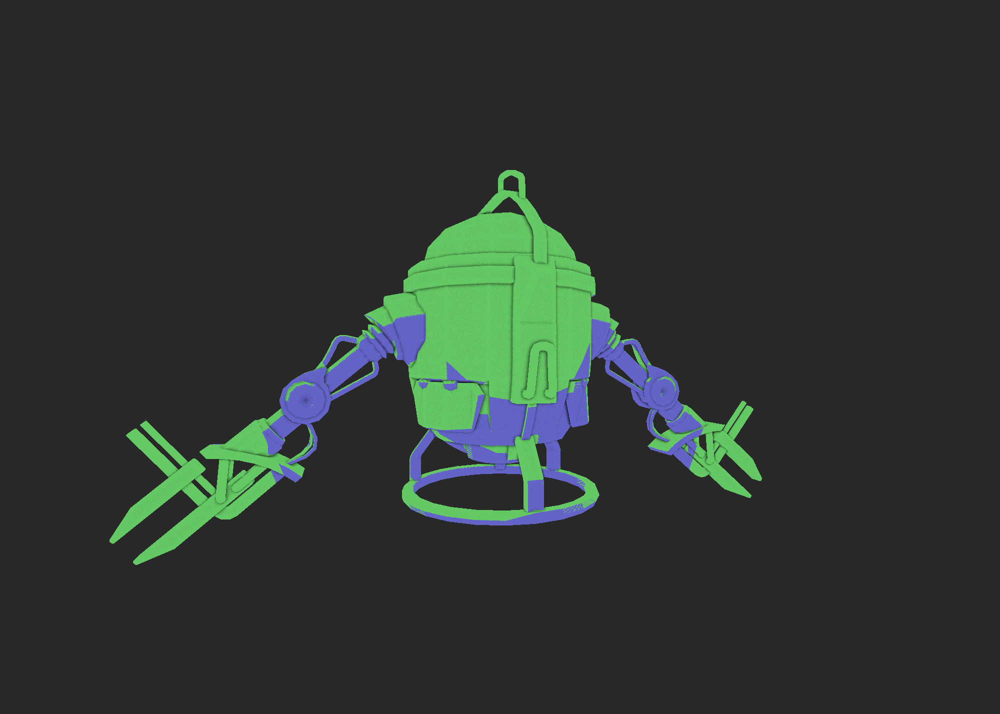

## Software renderer

In this project I attempt to explicitely implement what a graphics API hides from the user. The renderer rasterizes the model and via a programmable pipeline lets the user implements more advanced features like SSAO or shadow mapping. Everything runs on the CPU.

The project is intended for educational purposes (and fun).

### Some pictures

Z-buffer and screen space ambient occlusion:

|                           Z-buffer                           |                             SSAO                             |
| :----------------------------------------------------------: | :----------------------------------------------------------: |
|  |  |

Toon shader:

|                                                              |                                                              |
| :----------------------------------------------------------: | :----------------------------------------------------------: |
|  |  |

Shadows (in green); notice the ugly z-fighting:

|                                                              |                                                              |
| :----------------------------------------------------------: | :----------------------------------------------------------: |
|  |  |

Whit and without normal map (and simple shading):

|                             With                             |                           Without                            |
| :----------------------------------------------------------: | :----------------------------------------------------------: |
|  |  |

Full models:

|                                                              |                                                              |
| :----------------------------------------------------------: | :----------------------------------------------------------: |
|  |  |

