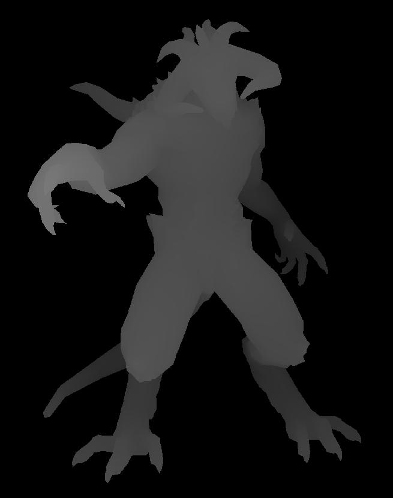
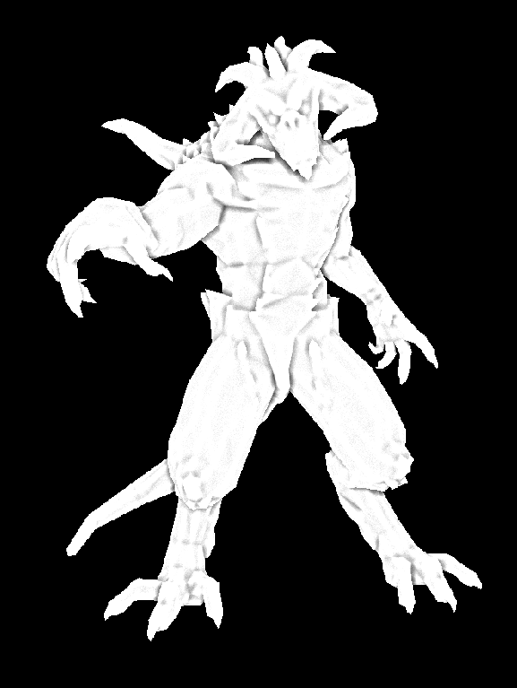
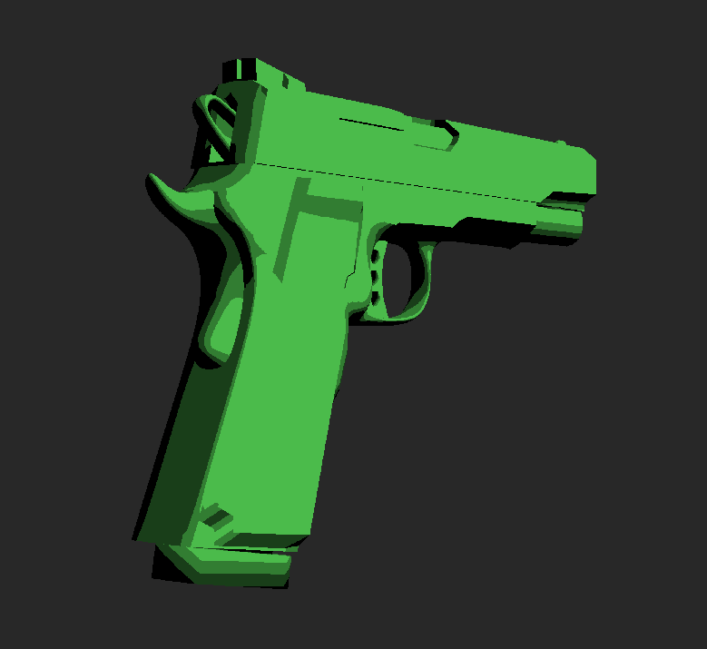
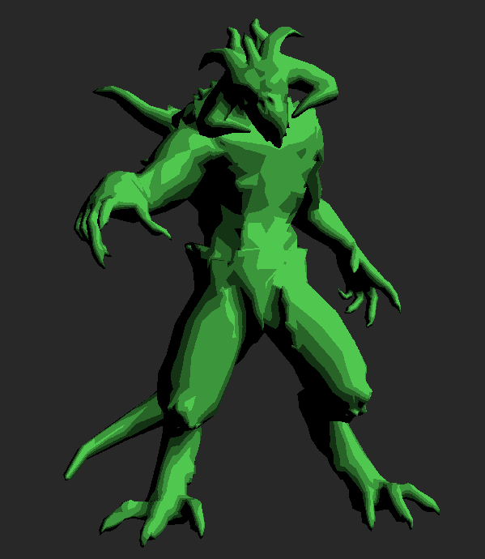
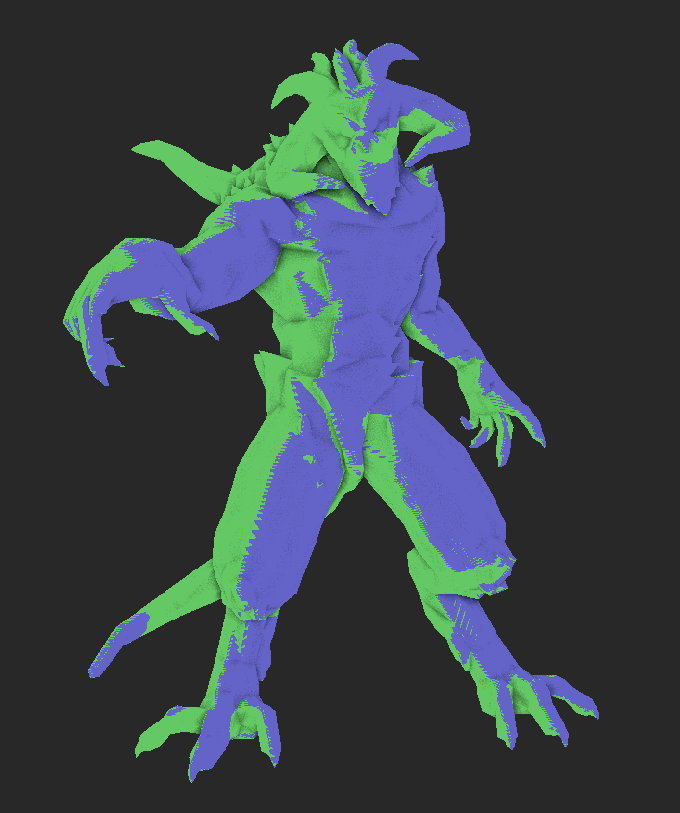
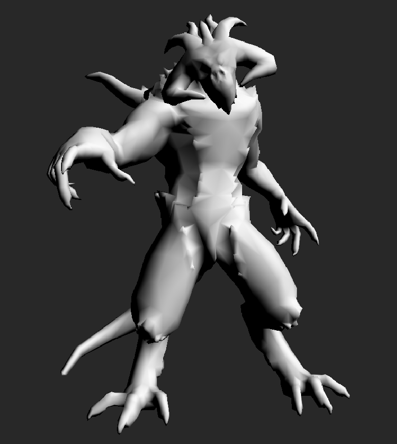
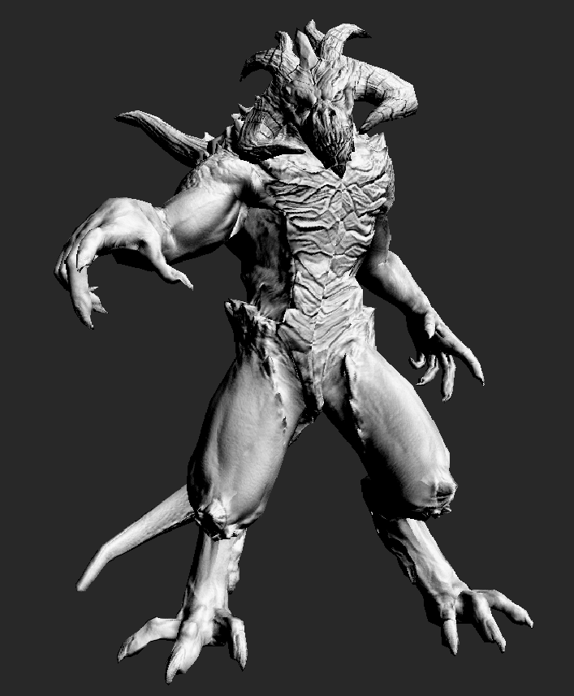
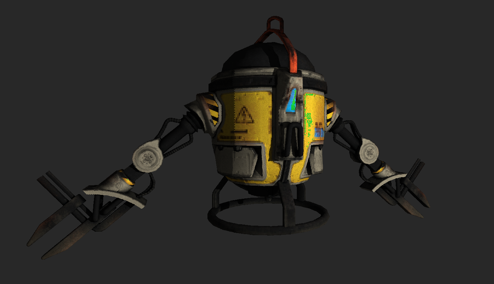
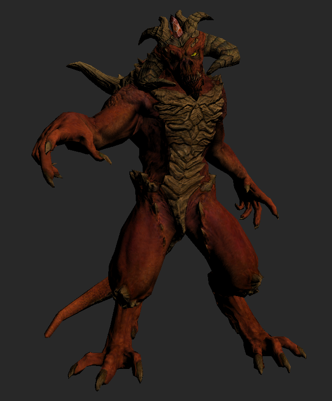

## Software renderer

In this project I attempt to explicitely implement what a graphics API hides from the user. The renderer rasterizes the model and via a programmable pipeline lets the user implements more advanced features like SSAO or shadow mapping. Everything runs on the CPU.

The project is intended for educational purposes (and fun).

### Some pictures

Z-buffer and screen space ambient occlusion:

|                          Z-buffer                           |                         SSAO                          |
| :---------------------------------------------------------: | :---------------------------------------------------: |
|  |  |

Toon shader:

|                                                        |                                                          |
| :----------------------------------------------------: | :------------------------------------------------------: |
|  |  |

Shadows (in green); notice the ugly z-fighting:

|                                                       |                                                              |
| :---------------------------------------------------: | :----------------------------------------------------------: |
|  |  |

Whit and without normal map (and simple shading):

|                            With                            |                         Without                         |
| :--------------------------------------------------------: | :-----------------------------------------------------: |
|  |  |

Full models:

|                                                          |                                                             |
| :------------------------------------------------------: | :---------------------------------------------------------: |
|  |  |

